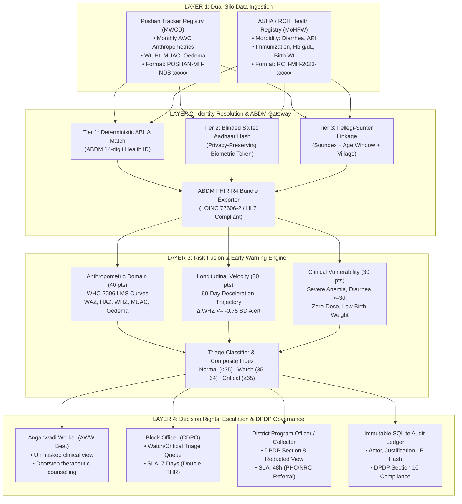

# ARCHITECTURE.md — System Design & Data Flow Specifications

## 1. Executive Summary & Design Philosophy

**Poshan-Suraksha** is a state-grade **Data Governance & Early-Warning Decision-Support System (DSS)** engineered for the **Techfest, IIT Bombay 2026-27 "India @ 71/100 Challenge"** under **Theme 1: Maternal & Early Childhood Nutrition**.

The system addresses the fundamental structural flaw in India's nutrition tech ecosystem: **data is abundant (~9 crore children tracked in Poshan Tracker), but action is retrospective.** Growth faltering is recorded *after* severe acute malnutrition (SAM) develops, and growth tracking (MWCD) operates in a vacuum insulated from clinical illness and immunization data (MoHFW).

```
Poshan-Suraksha resolves this by applying a clinical triage pattern:
[Multi-Domain Inputs] ──> [Per-Domain Subscores] ──> [Composite Risk Index] ──> [Tiered Triage] ──> [Role-Based Escalation]
```

---

## 2. Four-Layer Architectural Blueprint



---

## 3. Deep Architectural Layer Breakdown

### Layer 1: Dual-Silo Ingestion & Synthetic Microdata
- **Poshan Tracker (MWCD)**: Captures cross-sectional monthly growth measurements:
  - Weight in kilograms (precision: 10g),
  - Length/Height in centimeters (precision: 0.1cm),
  - Mid-Upper Arm Circumference (MUAC in mm),
  - Bilateral pitting oedema flag (clinical emergency).
- **Health / ASHA System (MoHFW)**: Captures acute morbidity:
  - Episode frequency of acute diarrhea within the past 30 days (causes rapid nutrient malabsorption),
  - Acute Respiratory Infections (ARI/pneumonia),
  - Hemoglobin concentration (Hb in g/dL),
  - Low Birth Weight (< 2.5 kg),
  - Past admission history to Nutritional Rehabilitation Centres (NRC).

### Layer 2: Identity Resolution & ABDM Interoperability
Because India does not yet possess 100% universal ABHA adoption among infants under 5 in tribal belts (~55% in our simulated cohort), a single identifier cannot be assumed. The platform uses a 3-tier cascade:
1. **Deterministic ABHA Match**: Exact match on 14-digit ABDM Health ID (`Confidence: 1.00`).
2. **Blinded Biometric Token Match**: Salted SHA-256 hash of guardian/child identity (`Confidence: 0.98`).
3. **Probabilistic Multi-Attribute Linkage**:
   - Geographic hard-block constraint: $Block_{Poshan} == Block_{ASHA}$,
   - Gender exact match,
   - Age concordance within $\pm 2$ months window,
   - Phonetic Soundex similarity on child and mother tokens,
   - Village/AWC locality proximity.
   - Match categorized into:
     - `PROBABILISTIC_HIGH` ($\ge 0.80$): Automatically joined.
     - `PROBABILISTIC_MEDIUM` ($0.60 - 0.79$): Queued for frontline ASHA confirmation during monthly Village Health, Sanitation and Nutrition Day (VHSND).
     - `UNLINKED` ($< 0.60$): Maintained as independent registries.
4. **ABDM FHIR R4 Bundle**: Standardizes observations (`LOINC 77606-2: Weight-for-length/height z-score`) for bi-directional exchange with national registries.

### Layer 3: Risk-Fusion & Longitudinal Velocity Engine
Traditional nutrition dashboards calculate static cross-sectional classification. Poshan-Suraksha implements multi-parameter clinical triage:

$$\text{Composite Risk Index} = \text{Anthro Score (0–40)} + \text{Velocity Score (0–30)} + \text{Health Vulnerability (0–30)}$$

#### 1. Anthropometric Domain (Max 40 points):
- Bilateral pitting oedema: $+40$ (immediate fail-safe override to Critical).
- $WHZ < -3.0$ SD (Severe Wasting): $+35$ (immediate Critical override).
- $-3.0 \le WHZ < -2.0$ SD (Moderate Wasting): $+22$.
- $MUAC < 115\text{ mm}$ (Red tape SAM): $+35$.
- $115 \le MUAC < 125\text{ mm}$ (Yellow tape MAM): $+20$.
- $HAZ < -3.0$ SD (Severe Stunting): $+15$.

#### 2. Longitudinal Velocity Domain (Max 30 points) — The Early-Warning Core:
Tracks 60-day acceleration/deceleration:
- Acute WHZ drop $\le -1.0$ SD over 60 days: $+28$ points.
- Moderate faltering $\le -0.5$ SD: $+18$ points.
- Absolute weight loss $\ge 0.2\text{ kg}$ in infant: $+15$ points.
*Crucial Innovation*: A child dropping from $+0.2$ to $-1.6$ SD has not yet crossed the standard $-2.0$ MAM threshold, yet will be flagged by our engine in the **Watch Tier**, alerting frontline workers 3 to 6 weeks earlier.

#### 3. Health System Vulnerability (Max 30 points):
- Zero-dose child (completely unvaccinated): $+12$ points.
- Protracted diarrhea ($\ge 5$ days in past month): $+10$ points.
- Acute Respiratory Infection (ARI): $+8$ points.
- Severe anemia ($Hb < 7.0\text{ g/dL}$): $+12$ points.
- Prior NRC admission history: $+8$ points.

### Layer 4: Role-Based Decision Rights & Escalation Protocol

| Administrative Tier | Primary Persona | Data Visibility Scope | Assigned Escalation Protocol | Statutory SLA |
| :--- | :--- | :--- | :--- | :--- |
| **Beat / Village Level** | Anganwadi Worker (AWW) & ASHA Worker | Unmasked identifiable records for their assigned beat (`awc_id`) only | Doorstep home visit; double-ration Take-Home Ration (THR); counseling; re-weigh in 14 days | **Watch: 7 Days (168h)** |
| **Block Level** | Child Development Project Officer (CDPO) & PHC Medical Officer | Pseudonymized case list for the entire block; aggregated risk metrics | Dispatch mobile health team; issue NRC referral slip; coordinate transport voucher | **Critical: 48 Hours** |
| **District Level** | District Program Officer (DPO) & District Collector | **DPDP Section 8 Redacted View**: Initials masked (`A*** P***`), macro epidemiologic trends | Inter-block resource allocation; supply chain replenishment; SLA breach audits | **Weekly Convergence Review** |
| **State Level** | Mission Poshan 2.0 Director / Admin | Macro analytics + full tamper-evident audit ledger | Policy evaluation; infrastructure provisioning; statutory compliance oversight | **Continuous Audit** |

---

## 4. Operational Scalability & Production Database Topology

While the standalone competition prototype runs on **FastAPI + in-memory state + SQLite audit store** for friction-free local execution and evaluation, the design directly maps to national-scale Digital Public Infrastructure (DPI):

```
[National Ingestion Layer] ──> [Kafka / Event Hub] ──> [Apache Flink Stream Scoring]
                                                              │
                    ┌─────────────────────────────────────────┴────────────────────────┐
                    ▼                                                                  ▼
[PostgreSQL + Citus (Transactional State)]                   [ClickHouse / Apache Iceberg (Analytics Data Lake)]
  • Beneficiary Profile & Longitudinal Ledger                 • District & State Epidemiological Cubes
  • Active Escalation SLA Queues                              • NFHS Historical Cohort Trending
  • Tamper-Evident DPDP Audit Partitioning                    • Automated Anomaly & Fraud Detection
```
