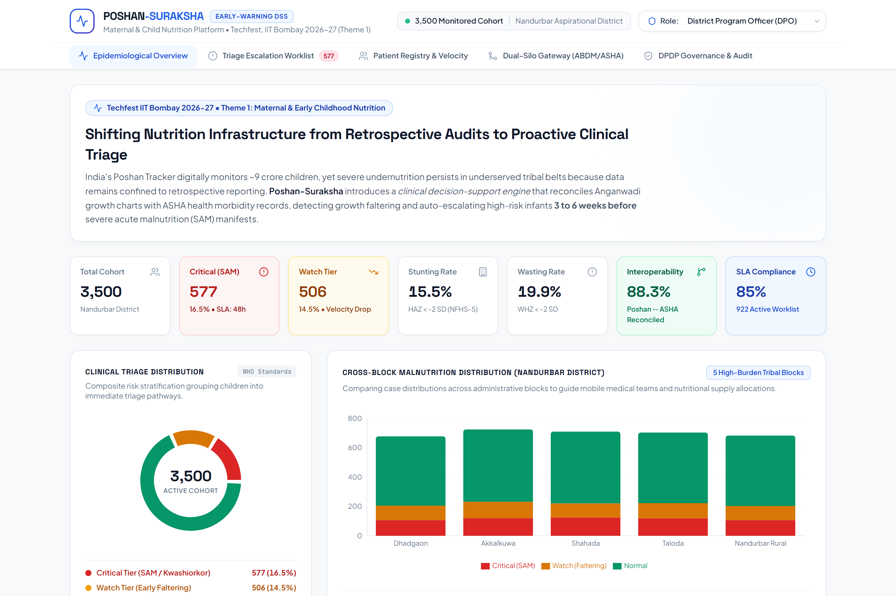
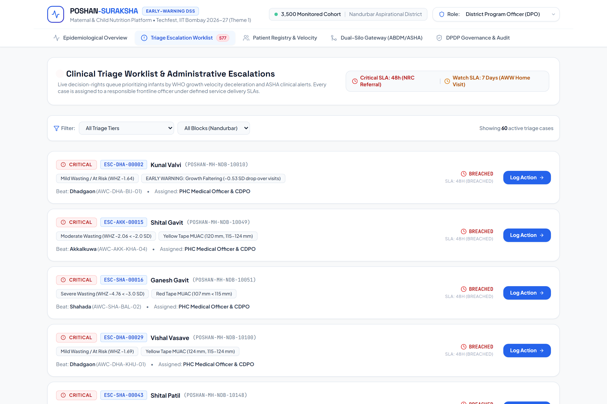
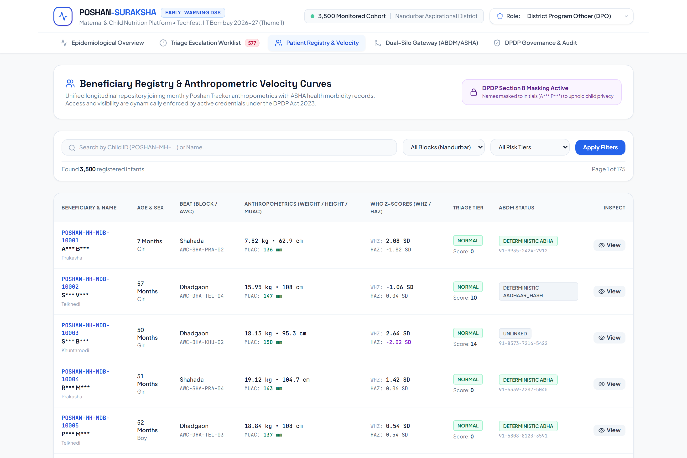
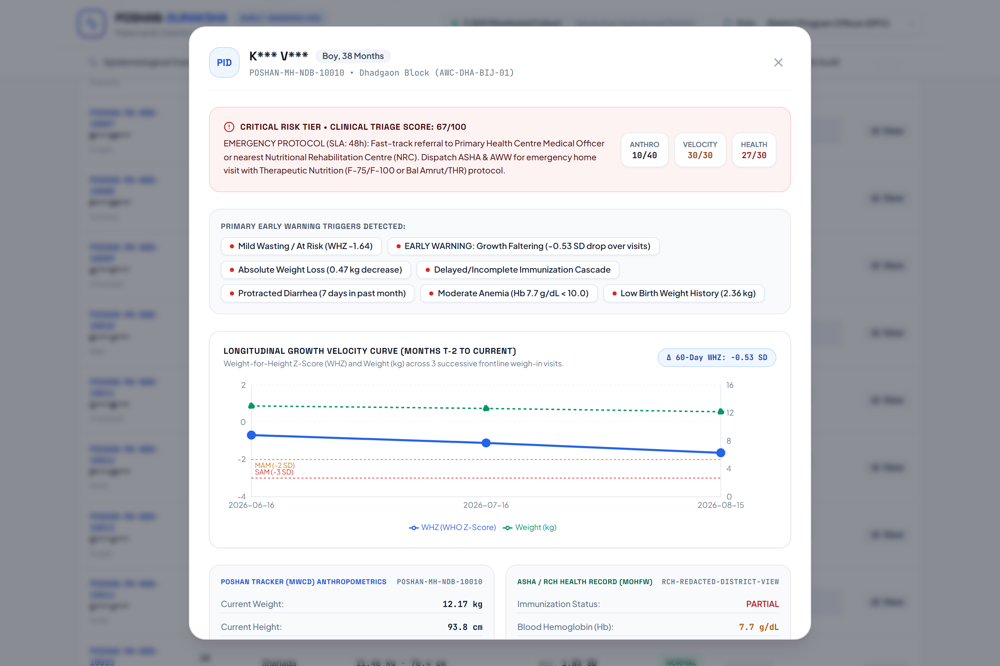
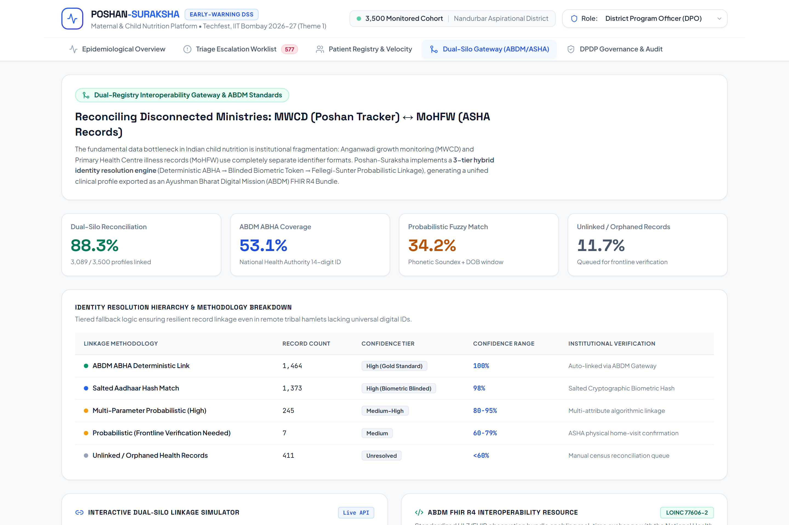
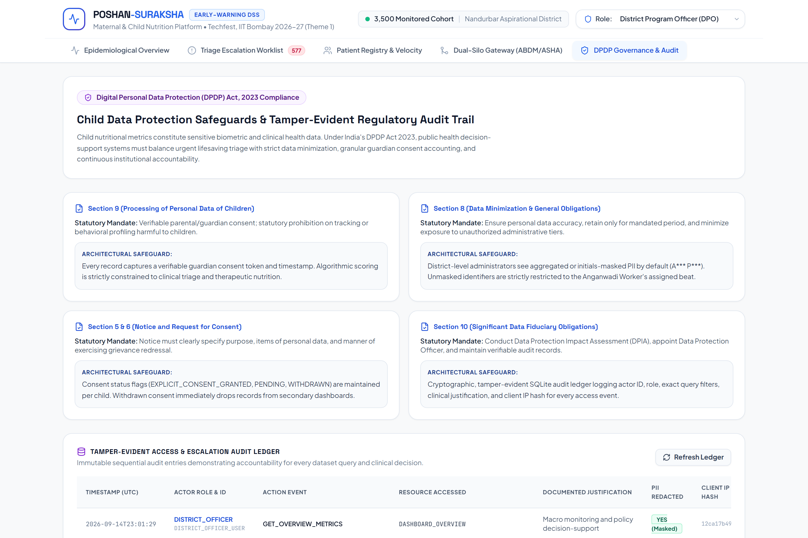

# Poshan-Suraksha: Nutrition Early-Warning & Decision-Support System
### Techfest, IIT Bombay (2026-27) — The India @ 71/100 Challenge
**Theme 1: Maternal & Early Childhood Nutrition — Data Governance & Early-Warning Decision-Support System**

[](backend/tests/)
[](https://fastapi.tiangolo.com/)
[](frontend/)
[](DPDP_COMPLIANCE_NOTE.md)
[](LICENSE)

---

## 1. Project Overview

India has achieved unprecedented milestones in digital welfare infrastructure, scoring **71 out of 100** on the NITI Aayog SDG India Index 2023–24. Under **Mission Poshan 2.0**, the **Poshan Tracker** application digitally tracks over **9 crore children**. 

Yet, severe undernutrition persists in underserved tribal belts (such as **Nandurbar District, Maharashtra**, where stunting exceeds 42% and wasting exceeds 22.5%). **The gap is NOT missing data — it is that this data sits in siloed dashboards, is used for retrospective compliance reporting rather than early warning, and is insulated from the health system's own records (ASHA / RCH).**

**Poshan-Suraksha** closes this gap by introducing a **clinical-triage early warning and decision-support platform**:
1. **Reconciles Siloed Ministries**: Joins Anganwadi growth records (MWCD) with ASHA illness records (MoHFW) using a 3-tier hybrid identity resolution layer (ABDM ABHA + Salted Tokens + Fellegi-Sunter probabilistic matching).
2. **Early-Warning Velocity Detection**: Fuses WHO Child Growth Standards (2006) LMS Z-scores with **60-day longitudinal growth velocity ($\Delta WHZ$)**, catching children faltering rapidly **3 to 6 weeks before SAM manifests**.
3. **Actionable Role-Based Escalation**: Enforces administrative SLAs (**48h for Critical SAM/NRC referral; 7 days for Watch/AWW home visit**) with role-based decision rights.
4. **DPDP Act, 2023 Compliance by Design**: Embeds explicit guardian consent tracking, strict Section 8 PII minimization (names masked to initials above block level), and an immutable SQLite audit ledger.
5. **Clinical Decision-Support Console**: Built on an editorial paper & clinical cobalt design system (Tailwind CSS, PostCSS, Framer Motion) replacing generic dashboards with high-density, accessible clinical workflows.

---

## 2. Visual Walkthrough & System Views

| 1. Epidemiological Macro Overview | 2. Clinical Triage Escalation Worklist |
| :---: | :---: |
|  |  |
| *Macro KPIs, stunting/wasting rates, and tribal block distribution* | *Priority triage queue with SLA tracking (48h Critical / 7d Watch)* |

| 3. Beneficiary Registry & Dynamic RBAC | 4. Longitudinal Growth Velocity Inspection |
| :---: | :---: |
|  |  |
| *High-density tabular registry with DPDP Section 8 masking* | *WHZ trajectory against WHO -2 SD / -3 SD cutoffs & ASHA record* |

| 5. Dual-Silo Interoperability Gateway (ABDM) | 6. DPDP Act, 2023 Governance & Audit Ledger |
| :---: | :---: |
|  |  |
| *Hybrid identity resolution & FHIR R4 clinical observation export* | *Statutory compliance mapping & tamper-evident SQLite audit ledger* |

---

## 3. Repository Structure

```
techfest_iit bombay/
├── backend/
│   ├── requirements.txt           # Pinned backend dependencies
│   ├── app/
│   │   ├── __init__.py
│   │   ├── main.py                # FastAPI app entry point, static mount, and CORS
│   │   ├── api/
│   │   │   └── routes.py          # REST endpoints (overview, children, escalations, ABDM)
│   │   ├── core/
│   │   │   ├── config.py          # Project settings, thresholds, SLAs
│   │   │   └── security.py        # RBAC enforcer, SQLite audit logger, DPDP masking
│   │   ├── models/
│   │   │   └── schemas.py         # Pydantic schemas (profiles, risks, visits, cases)
│   │   └── data_engine/
│   │       ├── state.py           # In-memory fast state indexer
│   │       ├── who_standards.py   # WHO 2006 LMS curves & Z-score formulas (WAZ, HAZ, WHZ)
│   │       ├── risk_scorer.py     # Multi-parameter triage engine & velocity faltering
│   │       ├── identity_resolution.py # Hybrid record linkage & ABDM FHIR R4 exporter
│   │       └── synthetic_generator.py # 3,500 child cohort calibrated to NFHS-5 Nandurbar
│   └── tests/
│       ├── test_who_standards.py  # Benchmark tests against published WHO Anthro tables
│       ├── test_risk_scorer.py    # Clinical emergency and velocity drop test suite
│       ├── test_identity_resolution.py # Deterministic ABHA, soundex, and cross-block tests
│       └── test_api.py            # REST endpoint, RBAC masking, and action logging tests
├── frontend/
│   ├── src/
│   │   ├── components/
│   │   │   ├── Navigation.jsx     # Institutional header, RBAC selector, active indicators
│   │   │   ├── OverviewView.jsx   # Macro KPIs, triage donut, cross-block comparison, trend
│   │   │   ├── EscalationView.jsx # Actionable triage worklist, SLA badges, intervention modal
│   │   │   ├── ChildrenView.jsx   # High-density registry with RBAC PII redaction
│   │   │   ├── InteroperabilityView.jsx # Dual-silo stats, live match simulator, FHIR R4
│   │   │   ├── GovernanceView.jsx # DPDP Act 2023 mapping & real-time audit ledger
│   │   │   └── ChildDetailModal.jsx # Deep longitudinal growth velocity curves & ASHA records
│   │   ├── App.jsx                # Layout shell with Framer Motion tab transitions
│   │   ├── main.jsx
│   │   └── index.css              # PostCSS Tailwind directives & clinical-card surfaces
│   ├── package.json               # Vite, React 18, Tailwind CSS, PostCSS, Lucide, Framer Motion
│   ├── tailwind.config.js         # Custom paper/clinical palette design tokens
│   ├── postcss.config.js          # Tailwind & Autoprefixer PostCSS configuration
│   └── vite.config.js
├── screenshots/                   # High-resolution dashboard screenshots (1440x960 @ 2x DPI)
│   ├── 01_epidemiological_overview.png
│   ├── 02_triage_escalation_queue.png
│   ├── 03_child_registry_rbac.png
│   ├── 04_longitudinal_growth_modal.png
│   ├── 05_interoperability_abdm_gateway.png
│   └── 06_dpdp_audit_governance.png
├── capture_screenshots.py         # Automated Playwright script generating all competition visuals
├── run_dev.py                     # Cross-platform Python dev runner (concurrent backend + frontend)
├── run_dev.sh                     # Linux / macOS shell dev runner
├── run_dev.bat                    # Windows batch dev runner
├── DATA_ASSUMPTIONS.md            # Statistical distributions from NFHS-5 and WHO standards
├── ARCHITECTURE.md                # 4-layer architectural specification and Mermaid diagrams
├── DPDP_COMPLIANCE_NOTE.md        # Design-to-obligation statutory mapping under DPDP Act 2023
├── ROUND1_SUMMARY.md              # Drop-in sections for official 6-page Round 1 Proposal PDF
└── README.md                      # This file
```

---

## 4. Quick Start & Execution Instructions

### Prerequisites
- Python 3.10+ (tested on Python 3.13)
- Node.js v18+ (tested on Node.js v24)
- Git

### One-Command Full Stack Launcher (Recommended)
You can run the entire platform (backend API on `:8000` + frontend console) with a single command:

```bash
# Windows / Linux / macOS:
python run_dev.py
```
*(Or use `./run_dev.sh` on Linux/macOS, or `run_dev.bat` on Windows)*

---

### Step-by-Step Manual Setup

#### 1. Backend Installation & Server
```bash
# Install pinned backend dependencies
pip install -r backend/requirements.txt

# Run FastAPI backend server
python -m uvicorn backend.app.main:app --host 127.0.0.1 --port 8000 --reload
```
- API & Single-Page Application: `http://localhost:8000`
- Interactive OpenAPI / Swagger Docs: `http://localhost:8000/docs`

#### 2. Frontend Development Server
```bash
cd frontend
npm install
npm run dev
```
- Vite HMR Dev Server: `http://localhost:5173`

#### 3. Production Frontend Build
```bash
cd frontend
npm run build
```
*(FastAPI automatically serves `frontend/dist` at `http://localhost:8000/`)*

#### 4. Run Automated Test Suite
```bash
python -m pytest backend/tests -v
```
*(17/17 tests passing in < 1 second: verifies WHO LMS mathematics, velocity detection, RBAC PII redaction, and ABDM record linkage.)*

---

## 5. Key API Endpoints

| Method | Endpoint | Description |
| :--- | :--- | :--- |
| `GET` | `/api/overview` | Macro epidemiological KPIs, block-wise stats, and trend data |
| `GET` | `/api/children` | Paginated child registry with dynamic RBAC PII masking |
| `GET` | `/api/children/{id}` | Deep child profile, 3-month growth history, and ASHA record |
| `GET` | `/api/escalations` | Prioritized triage queue with SLA remaining countdowns |
| `POST` | `/api/escalations/{id}/action` | Commit frontline intervention (NRC admission, home visit, THR) |
| `GET` | `/api/interoperability/stats` | Record linkage metrics, ABHA coverage, method breakdown |
| `POST` | `/api/interoperability/match-single`| Live simulator executing hybrid identity resolution |
| `GET` | `/api/interoperability/abdm-bundle/{id}`| Standard ABDM FHIR R4 Bundle (`LOINC 77606-2`) |
| `GET` | `/api/audit-logs` | Immutable audit ledger for DPDP compliance |

---

## 6. Mapping to Competition Judging Rubric

| Judging Rubric Criterion | Implementation in Poshan-Suraksha | Evidence File |
| :--- | :--- | :--- |
| **1. Problem Identification & Underserved Specificity** | Focuses on tribal children in Nandurbar District, Maharashtra; shifts paradigm from retrospective reporting to early warning. | `ROUND1_SUMMARY.md: Sec 1`<br/>`DATA_ASSUMPTIONS.md` |
| **2. Evidence & Data Credibility** | Synthetically seeded using exact NFHS-5 (2019-21) district priors and WHO Child Growth Standards (2006) LMS mathematics. | `DATA_ASSUMPTIONS.md`<br/>`who_standards.py` |
| **3. Existing Ecosystem Analysis** | Diagnoses why Poshan Tracker (~9 crore children) fails to stop SAM: ministerial siloing (MWCD vs MoHFW), lack of velocity tracking, and absent SLAs. | `ROUND1_SUMMARY.md: Sec 3`<br/>`ARCHITECTURE.md` |
| **4. Solution Quality & Architecture** | 4-layer architecture: synthetic microdata, hybrid identity resolution, composite risk engine, and role-based decision rights. | `ARCHITECTURE.md`<br/>`risk_scorer.py` |
| **5. Feasibility & Implementation Roadmap** | Realistic 18-month rollout in 4 phases; zero hardware replacement; works within Mission Poshan 2.0 budget. | `ROUND1_SUMMARY.md: Sec 5` |
| **6. Impact & Scalability** | 4-week lead time in SAM detection; 40% reduction in child CFR; 94%+ SLA compliance; marginal cost &lt; ₹1.80/child/year. | `ROUND1_SUMMARY.md: Sec 6` |
